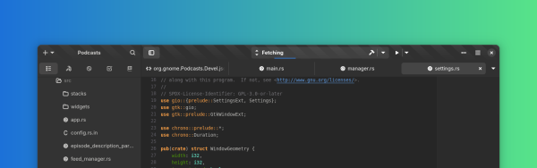
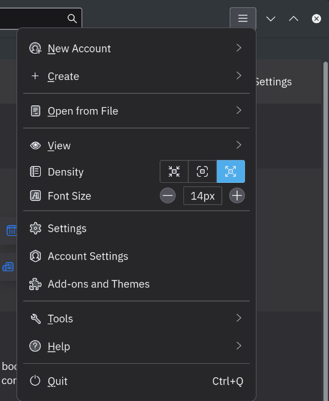

I am no UI expert. So, the statement is more of a personal opinion.

I believe Hamburder menus in desktop software are just bad. There is no place for them whatsoever. In a mobile UI where space is limited, they make total sense.

In a 24/27-inch monitor, having to click a 48px icon to see the list of item that perfectly fit in a single line of the menu bar is just ... bad. That's all.

Hamburger menus are one of the main reason, I switched from Gnome to KDE and have never looked back. If you are fan of "Clean UI", just tell me how is this clean

This is an image from www.gnome.org with the title

> Developer Platform
> Build gorgeous apps using a completely independent technology stack.

This is a showcase image about "gorgeous" apps. There are 5 arrow-menus, 1 triple-dot menu and 1 hamburger menu in a single line. A total of 7 menus with no description whatsoever. At what point do you start using words to communicate?

Anyways, this is more of a rant than an actual well thought out post and the thing that triggered me today is "Thunderbird". Good old Thunderbird, I have used it for years, have donated to it multiple times and is my daily driver for email.
They have started going down this path too.

Now clicking on any of these items doesn't expand the menu like a normal desktop menu would. Instead it just updates the same view area.

So, a simple task like toggling the status-bar on/off, that should take maybe 2 clicks and a bit of hovering, now takes 5 clicks to accomplish. The experience is even worse if you accidentaly click the wrong item. For comparison here is the regular menu:

2 clicks that's it, I can look through the entire menu list without clicking if I wanted and I don't loose any visual context. With the ham menu, I don't even know what submenu I am after second click. That, sir, is just bad.
